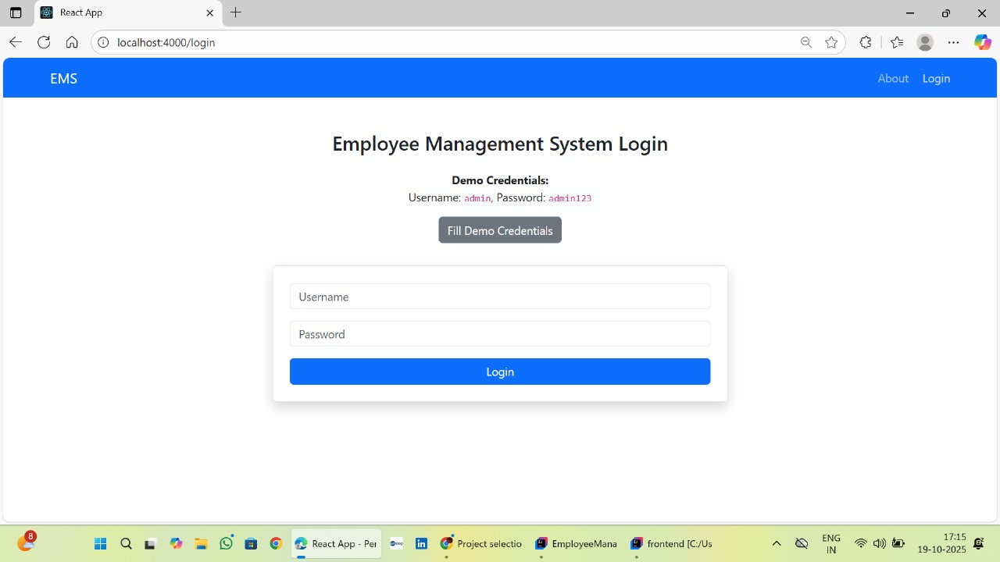
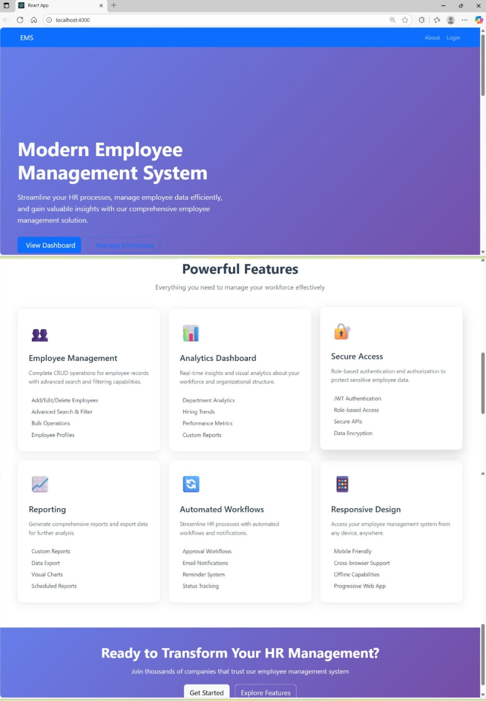
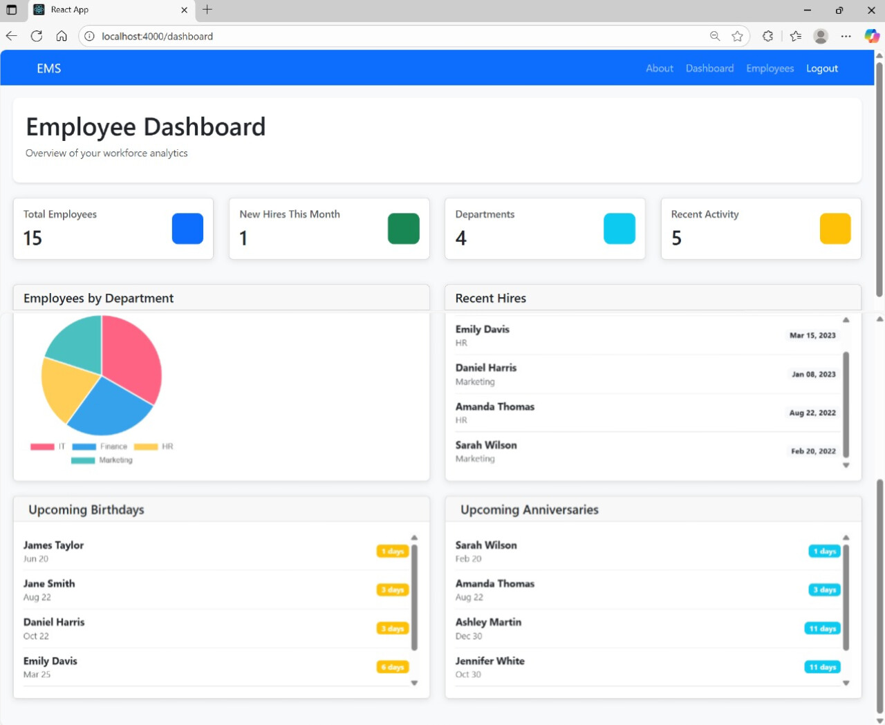
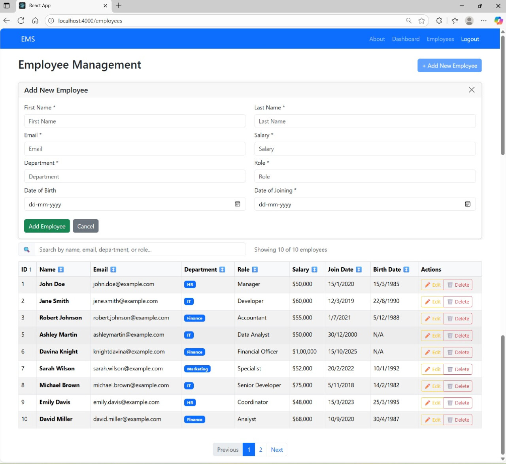

# Employee Management System (EMS)

A comprehensive **full-stack** Employee Management System built with **React frontend** and **Spring Boot backend**, featuring secure JWT authentication and complete CRUD operations.
> **Internship Project** - Developed as part of the CodeC Technologies Internship Program.

## 🚀 Features

### Core Employee Management
- Complete CRUD Operations - Create, Read, Update, Delete employees
- Advanced Search & Filtering - Real-time search by name, email, department, role
- Smart Sorting - Click any column header to sort data
- Pagination - Handle large datasets efficiently
- Form Validation - Client-side and server-side validation

### Dashboard & Analytics
- Real-time Dashboard - Comprehensive workforce overview
- Department Analytics - Visual charts showing employee distribution
- Key Metrics - Total employees, new hires, department counts
- Upcoming Events - Birthdays and work anniversaries (next 30 days)
- Recent Activity - Latest hires and changes

### Security & Authentication
- JWT Authentication - Secure token-based login
- Role-based Access - Admin role with full system access
- Protected Routes - Automatic redirect for unauthorized access
- Password Encryption - BCrypt secure password storage

### User Experience
- Responsive Design - Works perfectly on desktop, tablet, and mobile
- Professional UI - Modern Bootstrap-based interface
- Loading States - Smooth loading indicators and spinners
- Error Handling - User-friendly error messages
- Confirmation Dialogs - Safe delete operations

---

## 🛠️ Technology Stack

### Backend
- Java 17+ - Core programming language
- Spring Boot 3.x - Application framework
- Spring Security - Authentication and authorization
- Spring Data JPA - Database operations
- MySQL - Relational database
- Maven - Dependency management

### Frontend
- React 18 - User interface library
- React Router - Client-side routing
- Axios - HTTP client for API calls
- Chart.js - Data visualization
- Bootstrap 5 - UI components and styling
- Font Awesome - Icons

---

## 📦 Installation & Setup

### Prerequisites
- Java 17 or higher
- Node.js 16 or higher
- MySQL 8.0 or higher
- Maven 3.6+

### Backend Setup
1. Clone the repository:
    ```
    git clone <repository-url>
    cd EmployeeManagementSystem/backend
    ```
2. Configure database:
    ```
    CREATE DATABASE ems_db;
    ```
3. Update `application.properties`:
    ```
    spring.datasource.url=jdbc:mysql://localhost:3306/ems_db
    spring.datasource.username=your_username
    spring.datasource.password=your_password
    server.port=5000
    ```
4. Run the backend:
    ```
    mvn spring-boot:run
    ```

### Frontend Setup
1. Navigate to frontend directory:
    ```
    cd ../frontend
    ```
2. Install dependencies:
    ```
    npm install
    ```
3. Configure API base URL:
    ```
    // src/api/axiosConfig.js
    baseURL: 'http://localhost:5000/api'
    ```
4. Start the development server:
    ```
    npm start
    ```

---

## 🗃️ Database Schema

### Employee Table
```
CREATE TABLE employee (
    id INT AUTO_INCREMENT PRIMARY KEY,
    first_name VARCHAR(50) NOT NULL,
    last_name VARCHAR(50) NOT NULL,
    email VARCHAR(100) NOT NULL UNIQUE,
    salary DECIMAL(10,2) NOT NULL,
    date_of_joining DATE NOT NULL,
    date_of_birth DATE,
    department VARCHAR(50) NOT NULL,
    role VARCHAR(50) NOT NULL,
    status ENUM('ACTIVE','INACTIVE') DEFAULT 'ACTIVE'
);
```

---

## Default Admin User

- **Username:** admin
- **Password:** admin123

---

## 📊 API Endpoints

### Authentication
| Method | Endpoint           | Description |
|--------|------------------|-------------|
| POST   | /api/auth/login   | User login  |

### Employees
| Method | Endpoint                 | Description          |
|--------|--------------------------|--------------------|
| GET    | /api/employees           | Get all employees   |
| GET    | /api/employees/{id}      | Get employee by ID  |
| POST   | /api/employees           | Create new employee |
| PUT    | /api/employees/{id}      | Update employee     |
| DELETE | /api/employees/{id}      | Delete employee     |

### Dashboard
| Method | Endpoint                 | Description           |
|--------|--------------------------|---------------------|
| GET    | /api/dashboard/stats     | Get dashboard analytics |

---

## 🎯 Usage Guide

### Adding Employees
1. Navigate to Employees page
2. Click "Add New Employee"
3. Fill in required fields (marked with *)
4. Submit the form

### Managing Employees
- **Search:** Use the search bar to filter employees
- **Sort:** Click column headers to sort
- **Edit:** Click edit button on any employee row
- **Delete:** Click delete button (with confirmation)

### Dashboard Insights
- View total employee count
- See department distribution in pie chart
- Check recent hires and their roles
- Track upcoming birthdays and anniversaries
- Monitor new hires for the current month

---

## 🏗️ Project Structure

```
EmployeeManagementSystem/
├── backend/                 # Spring Boot application
│   ├── src/main/java/com/company/ems/
│   │   ├── config/         # Security and web configuration
│   │   ├── controller/     # REST API controllers
│   │   ├── dto/           # Data transfer objects
│   │   ├── model/         # JPA entities
│   │   ├── repository/    # Data access layer
│   │   └── service/       # Business logic
│   └── src/main/resources/
│       └── application.properties
└── frontend/               # React application
│   ├── src/
│   │   ├── api/           # API configuration
│   │   ├── components/    # Reusable components
│   │   ├── pages/         # Page components
│   │   └── App.js         # Main app component
│   └── public/
│        └── index.html
└── uploads/                # Screenshots of the project

```


---

## 🔧 Development

### Running in Development Mode

```
# Backend (port 5000)
cd backend
mvn spring-boot:run

# Frontend (port 4000)
cd frontend
npm start
```

---

## Building for Production

### Backend

```
mvn clean package
```

### Frontend

```
npm run build
```

---

## 🐛 Troubleshooting

### Common Issues

**CORS Errors:**
- Ensure backend is running on port 5000
- Check CORS configuration in SecurityConfig.java

**Database Connection:**
- Verify MySQL is running
- Check database credentials in application.properties

**Authentication Issues:**
- Use default credentials: admin/admin123
- Check JWT configuration

**Frontend Build Issues:**
- Clear node_modules and reinstall dependencies
- Check Node.js version compatibility

## 🖼️ Screenshots

All screenshots are in the `uploads/` folder. Example usage in markdown:





## 🤝 Contributing

1. **Fork the repository**

2. **Create a feature branch:**
```
git checkout -b feature/AmazingFeature
```

3. **Commit your changes:**

```
git commit -m 'Add some AmazingFeature'
```

4. **Push to the branch:**
```
git push origin feature/AmazingFeature
```

5. **Open a Pull Request**

---

## 📄 License

This project is licensed under the MIT License — see the LICENSE file for details.

---

## 👥 Authors

**Bibi Amina**  
🎓 **MCA Student | Aspiring Full Stack Developer & Data Analyst**

---

## 🙏 Acknowledgments
- Spring Boot team for the excellent framework
- React team for the powerful frontend library
- Bootstrap team for the UI components
- Chart.js for data visualization capabilities
- This project was completed as part of the **CodeC Technologies Internship Program**.

**Employee Management System** – Streamline your HR processes with modern, data-driven employee management.
